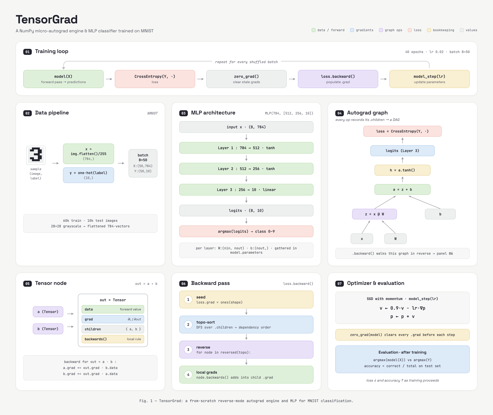

# TensorGrad

A from-scratch, reverse-mode automatic differentiation engine built on NumPy, with an MLP classifier that reaches **98.32%** test accuracy on MNIST.



## How it works

**The `Tensor` node.** Every operation (`+`, `*`, `@`, `**`, `tanh`, `sum`) produces a new `Tensor` that stores its forward value (`data`), its gradient (`grad`), links to the tensors that produced it (`children`), and a `backwards()` closure encoding the local derivative rule. Broadcasting is handled by an `unbroadcast` helper that sums gradients back down to each parent's shape.

**The computational graph.** Because every op links to its children, a forward pass implicitly builds a DAG. Calling `loss.backward()` seeds `loss.grad` with ones, runs a depth-first topological sort over `.children`, then walks the graph in reverse, letting each node's `backwards()` accumulate gradients into its parents — the chain rule, automated.

**The model.** `MLP(784, [512, 256, 10])` — two `tanh` hidden layers and a linear output layer. Each `Layer` holds a weight matrix `W : (nin, nout)` and bias `b : (nout,)`, all gathered in `model.parameters`.

**Training.** MNIST images are flattened to 784-vectors, scaled to `[0, 1]`, and one-hot labeled, then batched (`B = 50`). For 40 epochs at `lr = 0.02`, every shuffled batch runs the loop:

```
model(X) → CrossEntropyLoss → zero_grad → loss.backward() → model_step(lr)
```

`model_step` is SGD with momentum: `v ← 0.9·v − lr·∇p`, then `p ← p + v`. Evaluation compares `argmax(model(X))` against the true labels on the held-out test set.

## Repository layout

- **[`notebooks/`](notebooks/)**
  - [`tensorgrad.ipynb`](notebooks/tensorgrad.ipynb) — the full engine and MNIST training run shown in the diagram
  - [`micrograd.ipynb`](notebooks/micrograd.ipynb) — a scalar-valued autograd engine, following Karpathy's micrograd
  - [`simple_neural_network.ipynb`](notebooks/simple_neural_network.ipynb) — a small network built on the scalar engine
  - [`matrix_multiplication.ipynb`](notebooks/matrix_multiplication.ipynb) — matmul groundwork for the tensor engine
- **[`blog/`](blog/)** — the story behind the project
  - [`beginning.md`](blog/beginning.md) — what TensorGrad is and why it exists
  - [`micrograd.md`](blog/micrograd.md) — lessons from the scalar engine
  - [`jacobian.md`](blog/jacobian.md) — moving from scalars to tensors, and why Jacobians matter

## Roadmap

The NumPy engine is the working prototype. The longer-term goal, described in [`blog/beginning.md`](blog/beginning.md), is a C++ implementation of TensorGrad focused on faster training and inference.

## Acknowledgments

Inspired by [Andrej Karpathy's micrograd](https://github.com/karpathy/micrograd) — TensorGrad extends the same ideas from scalars to tensors.
